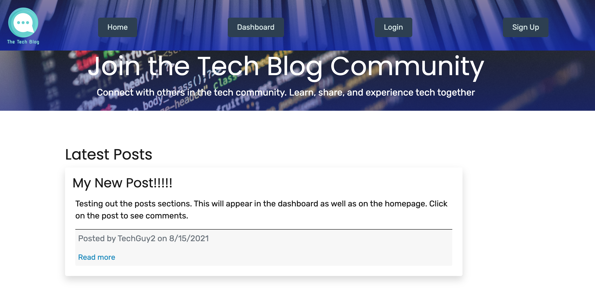
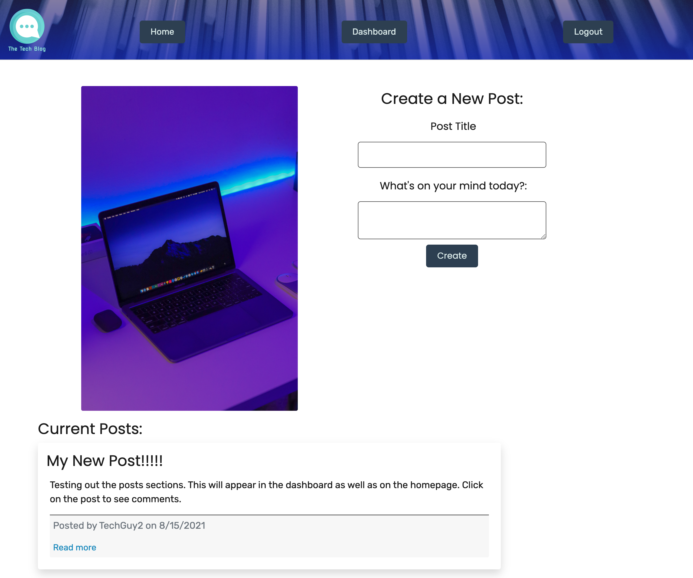
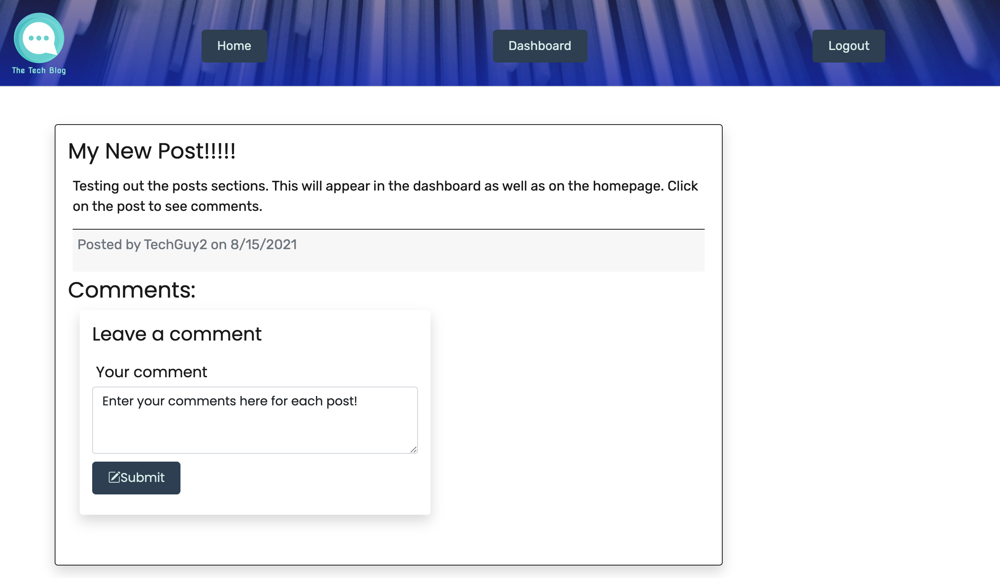

# the-tech-blog
## **Description**  
-------------
The Tech Blog is an application for users who are interested about the world of technology. The application is a way for tech users to post about anything having to do with tech. Users can create posts and can comment on each other's posts as well. Making it a great way to connect with others.

 ## **How to Use**
 ---------------
- The user would start at the homepage where they would be able to view any recent posts by all users.

-  For the user to interact with posts and comment on posts. The client must login or sign up. If the client tries to click on a post. They will be redirected to sign up/log in page. 
  
-The user must enter their email address and password to log into the site. If the user is not signed up, they must create a username and password. They will also enter their email address to use to login.

- Once logged in, the page will be redirected to the dashboard where the user can create their own posts and view other posts as well.

- The user can click on the posts to see the full post and comments. The posts can be clicked from the homepage and the dashboard.
  

- The user can enter their posts and see any existing comments. The user can also create delete any comments. 
  
-

- The user can logout from the logout button in the navbar, as seen below in the dashboard.

 

## **Built With**
---------------
- 
- 
- 
- 
- 

## **Contributors**
--------------------
  

- Rudy S. [GitHub](https://github.com/Rudys212)

## **License**
--------------------
MIT License

Copyright (c) 2021 Rudys212

Permission is hereby granted, free of charge, to any person obtaining a copy
of this software and associated documentation files (the "Software"), to deal
in the Software without restriction, including without limitation the rights
to use, copy, modify, merge, publish, distribute, sublicense, and/or sell
copies of the Software, and to permit persons to whom the Software is
furnished to do so, subject to the following conditions:

The above copyright notice and this permission notice shall be included in all
copies or substantial portions of the Software.

THE SOFTWARE IS PROVIDED "AS IS", WITHOUT WARRANTY OF ANY KIND, EXPRESS OR
IMPLIED, INCLUDING BUT NOT LIMITED TO THE WARRANTIES OF MERCHANTABILITY,
FITNESS FOR A PARTICULAR PURPOSE AND NONINFRINGEMENT. IN NO EVENT SHALL THE
AUTHORS OR COPYRIGHT HOLDERS BE LIABLE FOR ANY CLAIM, DAMAGES OR OTHER
LIABILITY, WHETHER IN AN ACTION OF CONTRACT, TORT OR OTHERWISE, ARISING FROM,
OUT OF OR IN CONNECTION WITH THE SOFTWARE OR THE USE OR OTHER DEALINGS IN THE
SOFTWARE.

## **Links** 
---------------
- [GitHub Repo](https://github.com/Rudys212/the-tech-blog)

- [Deployed app in Heroku](https://github.com/Rudys212/the-tech-blog)